Mixed Effect
================

# Linear Mixed-Effects Models

### A Simple Example of Random Effects

``` r
> library(nlme)
> data("Rail")
> plot( Rail )
```

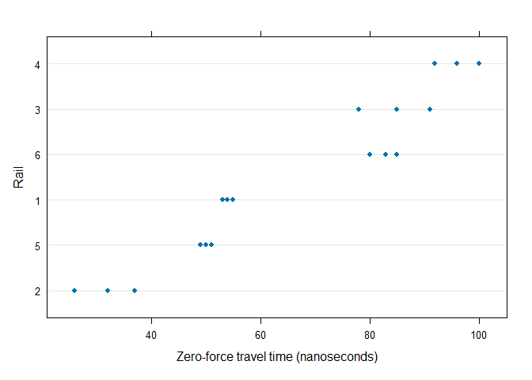<!-- -->

``` r
> Rail
```

    Grouped Data: travel ~ 1 | Rail
       Rail travel
    1     1     55
    2     1     53
    3     1     54
    4     2     26
    5     2     37
    6     2     32
    7     3     78
    8     3     91
    9     3     85
    10    4     92
    11    4    100
    12    4     96
    13    5     49
    14    5     51
    15    5     50
    16    6     80
    17    6     85
    18    6     83

singl-mean model
$$y_{ij} = \beta + \epsilon_{ij},\quad i=1,\dots,M,\quad j=1,\dots,n_i.$$

``` r
> fm1Rail.lm <- lm( travel ~ 1, data = Rail )
> fm1Rail.lm
```


    Call:
    lm(formula = travel ~ 1, data = Rail)

    Coefficients:
    (Intercept)  
           66.5  

``` r
> boxplot(fm1Rail.lm$residuals ~ Rail$Rail)
```

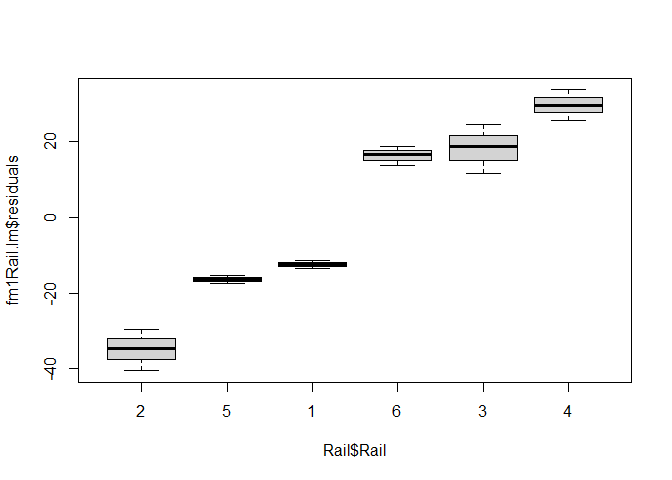<!-- --> fixed-effects
model
$$y_{ij} = \beta_i + \epsilon_{ij},\quad i=1,\dots,M,\quad j=1,\dots,n_i.$$

``` r
> fm2Rail.lm <- lm( travel ~ Rail - 1, data = Rail )
> fm2Rail.lm
```


    Call:
    lm(formula = travel ~ Rail - 1, data = Rail)

    Coefficients:
    Rail2  Rail5  Rail1  Rail6  Rail3  Rail4  
    31.67  50.00  54.00  82.67  84.67  96.00  

``` r
> boxplot(fm2Rail.lm$residuals ~ Rail$Rail)
```

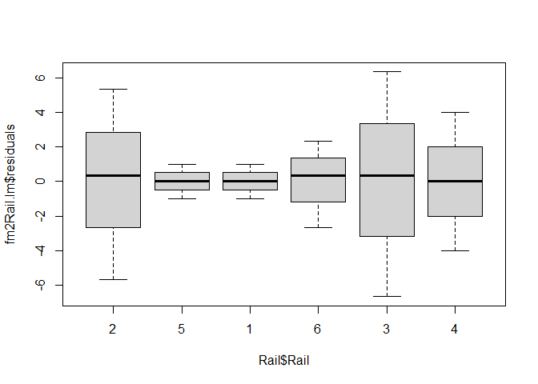<!-- --> random-effects
model $$\begin{aligned}
y_{ij} &= \beta + b_i + \epsilon_{ij},\quad i=1,\dots,M,\quad j=1,\dots,n_i,\\
b_i &\sim N(0,\sigma_b^2),\quad \epsilon_{ij}\sim N(0,\sigma^2)
\end{aligned}$$

``` r
> fm1Rail.lme <- lme( travel ~ 1, data = Rail, random = ~ 1 | Rail )
> summary(fm1Rail.lme)
```

    Linear mixed-effects model fit by REML
      Data: Rail 
          AIC      BIC   logLik
      128.177 130.6766 -61.0885

    Random effects:
     Formula: ~1 | Rail
            (Intercept) Residual
    StdDev:    24.80547 4.020779

    Fixed effects:  travel ~ 1 
                Value Std.Error DF  t-value p-value
    (Intercept)  66.5  10.17104 12 6.538173       0

    Standardized Within-Group Residuals:
            Min          Q1         Med          Q3         Max 
    -1.61882658 -0.28217671  0.03569328  0.21955784  1.61437744 

    Number of Observations: 18
    Number of Groups: 6 

``` r
> fm1Rail.lmeML <- update( fm1Rail.lme, method = "ML" )
> summary(fm1Rail.lmeML)
```

    Linear mixed-effects model fit by maximum likelihood
      Data: Rail 
         AIC      BIC    logLik
      134.56 137.2312 -64.28002

    Random effects:
     Formula: ~1 | Rail
            (Intercept) Residual
    StdDev:    22.62435 4.020779

    Fixed effects:  travel ~ 1 
                Value Std.Error DF  t-value p-value
    (Intercept)  66.5  9.554026 12 6.960417       0

    Standardized Within-Group Residuals:
            Min          Q1         Med          Q3         Max 
    -1.61098123 -0.28887045  0.03454166  0.21372780  1.62222279 

    Number of Observations: 18
    Number of Groups: 6 

``` r
> plot(fm1Rail.lme)
```

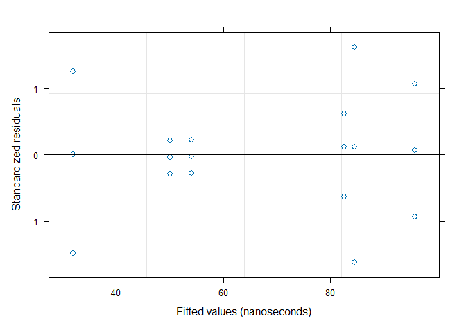<!-- -->

``` r
> intervals(fm1Rail.lme)
```

    Approximate 95% confidence intervals

     Fixed effects:
                   lower est.    upper
    (Intercept) 44.33921 66.5 88.66079

     Random Effects:
      Level: Rail 
                       lower     est.    upper
    sd((Intercept)) 13.27436 24.80547 46.35335

     Within-group standard error:
       lower     est.    upper 
    2.695012 4.020779 5.998737 

``` r
> anova(fm1Rail.lme)
```

                numDF denDF F-value p-value
    (Intercept)     1    12 42.7477  <.0001

### A Randomized Block Design

``` r
> data("ergoStool")
> plot( ergoStool )
```

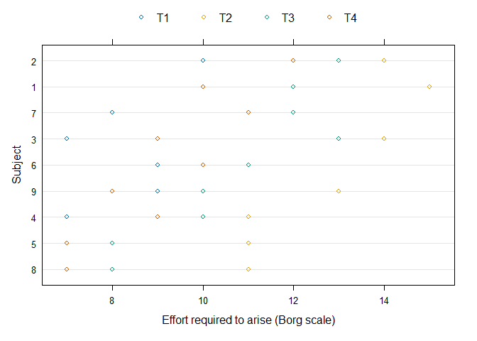<!-- -->

``` r
> plot.design(ergoStool)
```

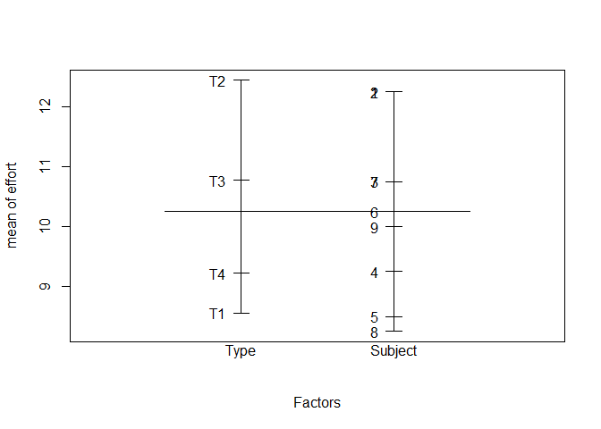<!-- --> fixed-effects
model

$$\begin{aligned}
y_{ij} & = \beta_j + b_i + \epsilon_{ij},\quad i=1,\dots,M,\quad j=1,\dots,n_i,\\
b_i &\sim N(0,\sigma_b^2),\quad \epsilon_{ij}\sim N(0,\sigma^2)
\end{aligned}$$

helmert contrasts

``` r
> options( contrasts = c( factor = "contr.helmert", ordered = "contr.poly" ) )
> contrasts( ergoStool$Type )
```

       [,1] [,2] [,3]
    T1   -1   -1   -1
    T2    1   -1   -1
    T3    0    2   -1
    T4    0    0    3

``` r
> fm1Stool <- lme(effort ~ Type, data = ergoStool, random =~1| Subject)
> summary( fm1Stool )
```

    Linear mixed-effects model fit by REML
      Data: ergoStool 
           AIC      BIC    logLik
      139.4869 148.2813 -63.74345

    Random effects:
     Formula: ~1 | Subject
            (Intercept) Residual
    StdDev:    1.332465 1.100295

    Fixed effects:  effort ~ Type 
                    Value Std.Error DF   t-value p-value
    (Intercept) 10.250000 0.4805234 24 21.330905  0.0000
    Type1        1.944444 0.2593419 24  7.497610  0.0000
    Type2        0.092593 0.1497311 24  0.618392  0.5421
    Type3       -0.342593 0.1058759 24 -3.235794  0.0035
     Correlation: 
          (Intr) Type1 Type2
    Type1 0                 
    Type2 0      0          
    Type3 0      0     0    

    Standardized Within-Group Residuals:
            Min          Q1         Med          Q3         Max 
    -1.80200345 -0.64316591  0.05783115  0.70099706  1.63142054 

    Number of Observations: 36
    Number of Groups: 9 

``` r
> anova( fm1Stool )
```

                numDF denDF  F-value p-value
    (Intercept)     1    24 455.0075  <.0001
    Type            3    24  22.3556  <.0001

treatment contrasts

``` r
> options( contrasts = c( factor = "contr.treatment", ordered = "contr.poly" ) )
> contrasts( ergoStool$Type )
```

       T2 T3 T4
    T1  0  0  0
    T2  1  0  0
    T3  0  1  0
    T4  0  0  1

``` r
> fm2Stool <- lme(effort ~ Type, data = ergoStool, random =~1| Subject)
> summary( fm2Stool )
```

    Linear mixed-effects model fit by REML
      Data: ergoStool 
           AIC      BIC    logLik
      133.1308 141.9252 -60.56539

    Random effects:
     Formula: ~1 | Subject
            (Intercept) Residual
    StdDev:    1.332465 1.100295

    Fixed effects:  effort ~ Type 
                   Value Std.Error DF   t-value p-value
    (Intercept) 8.555556 0.5760123 24 14.853079  0.0000
    TypeT2      3.888889 0.5186838 24  7.497610  0.0000
    TypeT3      2.222222 0.5186838 24  4.284348  0.0003
    TypeT4      0.666667 0.5186838 24  1.285304  0.2110
     Correlation: 
           (Intr) TypeT2 TypeT3
    TypeT2 -0.45               
    TypeT3 -0.45   0.50        
    TypeT4 -0.45   0.50   0.50 

    Standardized Within-Group Residuals:
            Min          Q1         Med          Q3         Max 
    -1.80200345 -0.64316591  0.05783115  0.70099706  1.63142054 

    Number of Observations: 36
    Number of Groups: 9 

``` r
> anova( fm2Stool )
```

                numDF denDF  F-value p-value
    (Intercept)     1    24 455.0075  <.0001
    Type            3    24  22.3556  <.0001

$$H_0:\quad \beta_2=\beta_3=\beta_4=0$$ cell-mean model

``` r
> fm3Stool <- lme(effort ~ Type - 1, data = ergoStool, random = ~ 1 | Subject)
> summary( fm3Stool )
```

    Linear mixed-effects model fit by REML
      Data: ergoStool 
           AIC      BIC    logLik
      133.1308 141.9252 -60.56539

    Random effects:
     Formula: ~1 | Subject
            (Intercept) Residual
    StdDev:    1.332465 1.100295

    Fixed effects:  effort ~ Type - 1 
               Value Std.Error DF  t-value p-value
    TypeT1  8.555556 0.5760123 24 14.85308       0
    TypeT2 12.444444 0.5760123 24 21.60448       0
    TypeT3 10.777778 0.5760123 24 18.71102       0
    TypeT4  9.222222 0.5760123 24 16.01046       0
     Correlation: 
           TypeT1 TypeT2 TypeT3
    TypeT2 0.595               
    TypeT3 0.595  0.595        
    TypeT4 0.595  0.595  0.595 

    Standardized Within-Group Residuals:
            Min          Q1         Med          Q3         Max 
    -1.80200345 -0.64316591  0.05783115  0.70099706  1.63142054 

    Number of Observations: 36
    Number of Groups: 9 

``` r
> anova( fm3Stool )
```

         numDF denDF  F-value p-value
    Type     4    24 130.5186  <.0001

$$H_0:\quad \beta_1 = \beta_2=\beta_3=\beta_4=0$$

- The overall effect of the factor should be assessed with anova, which
  does not depend on the choice of contrasts as long as the intercept
  term is retained in the model.
- Interpretation of the parameter estimates for a fixed-effects term
  depends on the contrasts being used.
- For REML estimation, likelihood-ratio tests or comparisons of AIC or
  BIC require the same fixed-effects structure and the same choice of
  contrasts in all models.

``` r
> intervals( fm1Stool )
```

    Approximate 95% confidence intervals

     Fixed effects:
                     lower        est.      upper
    (Intercept)  9.2582484 10.25000000 11.2417516
    Type1        1.4091890  1.94444444  2.4796999
    Type2       -0.2164373  0.09259259  0.4016224
    Type3       -0.5611097 -0.34259259 -0.1240755

     Random Effects:
      Level: Subject 
                        lower     est.    upper
    sd((Intercept)) 0.7496217 1.332465 2.368479

     Within-group standard error:
        lower      est.     upper 
    0.8295715 1.1002946 1.4593656 

``` r
> plot( fm1Stool, form = resid(., type = "p") ~ fitted(.) | Subject, abline = 0 )
```

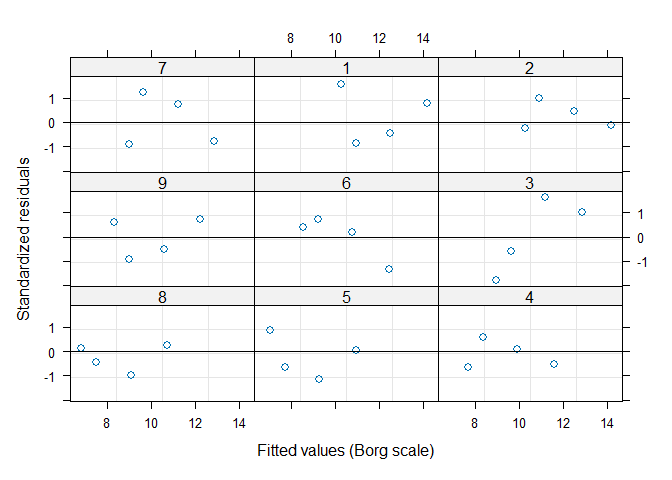<!-- -->

``` r
> stoolLRTsim <-simulate.lme( 
+   list(fixed = effort ~ 1, data = ergoStool, random =~1| Subject),
+   list(fixed = effort ~ Type),
+   method = "ML", nsim = 1000, seed = 1 )
> plot( stoolLRTsim, df = c(3, 4) )
```

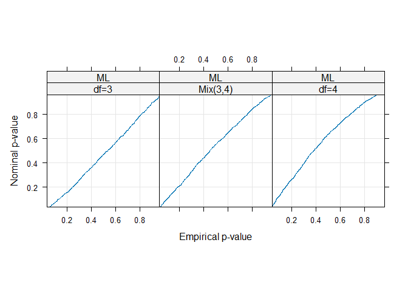<!-- -->

### Mixed-Effects Models for Replicated, Blocked Designs

``` r
> data("Machines")
> plot( Machines )
```

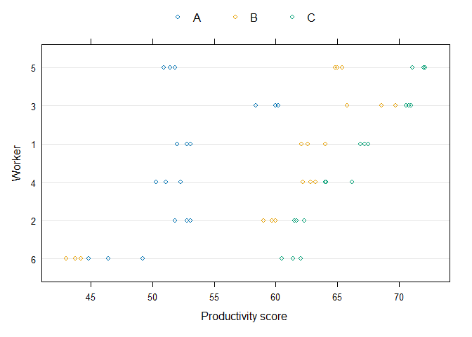<!-- -->

``` r
> attach( Machines ) 
> interaction.plot( Machine, Worker, score, las = 1) 
```

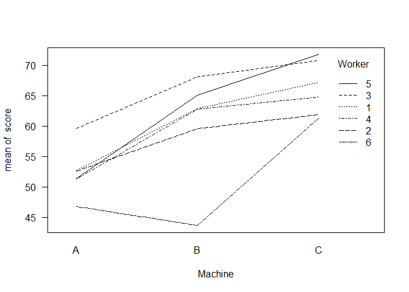<!-- -->

``` r
> detach()
```

$$\begin{aligned}
y_{ijk} & = \beta_j + b_i + b_{ij} + \epsilon_{ijk},\\
b_i &\sim N(0,\sigma_b^2),\quad \epsilon_{ijk}\sim N(0,\sigma^2)
\end{aligned}$$

``` r
> fm1Machine <- lme( score ~ Machine, data = Machines, random =~1| Worker )
> fm1Machine
```

    Linear mixed-effects model fit by REML
      Data: Machines 
      Log-restricted-likelihood: -143.4391
      Fixed: score ~ Machine 
    (Intercept)    MachineB    MachineC 
      52.355556    7.966667   13.916667 

    Random effects:
     Formula: ~1 | Worker
            (Intercept) Residual
    StdDev:    5.146552 3.161647

    Number of Observations: 54
    Number of Groups: 6 

``` r
> intervals( fm1Machine )
```

    Approximate 95% confidence intervals

     Fixed effects:
                    lower      est.    upper
    (Intercept) 47.868182 52.355556 56.84293
    MachineB     5.845311  7.966667 10.08802
    MachineC    11.795311 13.916667 16.03802

     Random Effects:
      Level: Worker 
                       lower     est.    upper
    sd((Intercept)) 2.697832 5.146552 9.817882

     Within-group standard error:
       lower     est.    upper 
    2.577325 3.161647 3.878446 

$$\begin{aligned}
y_{ijk} & = \beta_j + b_i + \epsilon_{ijk},\\b_i &\sim N(0,\sigma_1^2),\quad b_{ij} \sim N(0,\sigma_2^2),\quad \epsilon_{ijk}\sim N(0,\sigma^2)
\end{aligned}$$

``` r
> fm2Machine <- update( fm1Machine, random =~1| Worker/Machine )
> fm2Machine
```

    Linear mixed-effects model fit by REML
      Data: Machines 
      Log-restricted-likelihood: -107.8438
      Fixed: score ~ Machine 
    (Intercept)    MachineB    MachineC 
      52.355556    7.966667   13.916667 

    Random effects:
     Formula: ~1 | Worker
            (Intercept)
    StdDev:     4.78105

     Formula: ~1 | Machine %in% Worker
            (Intercept)  Residual
    StdDev:    3.729532 0.9615771

    Number of Observations: 54
    Number of Groups: 
                 Worker Machine %in% Worker 
                      6                  18 

``` r
> intervals( fm2Machine )
```

    Approximate 95% confidence intervals

     Fixed effects:
                    lower      est.    upper
    (Intercept) 47.314062 52.355556 57.39705
    MachineB     3.116071  7.966667 12.81726
    MachineC     9.066071 13.916667 18.76726

     Random Effects:
      Level: Worker 
                       lower    est.    upper
    sd((Intercept)) 2.249861 4.78105 10.15993
      Level: Machine 
                       lower     est.    upper
    sd((Intercept)) 2.382793 3.729532 5.837439

     Within-group standard error:
        lower      est.     upper 
    0.7635338 0.9615771 1.2109884 

``` r
> anova( fm1Machine, fm2Machine)
```

               Model df      AIC      BIC    logLik   Test  L.Ratio p-value
    fm1Machine     1  5 296.8782 306.5373 -143.4391                        
    fm2Machine     2  6 227.6876 239.2785 -107.8438 1 vs 2 71.19063  <.0001

unbalanced data

``` r
> ## delete selected rows from the Machines data
> MachinesUnbal <- Machines[ -c(2,3,6,8,9,12,19,20,27,33), ]
> ## check that the result is indeed unbalanced
> table(MachinesUnbal$Machine, MachinesUnbal$Worker)
```

       
        6 2 4 1 3 5
      A 3 2 2 1 1 3
      B 3 3 3 1 2 2
      C 3 3 3 3 3 3

``` r
> fm1MachinesU <- lme( score ~ Machine, data = MachinesUnbal,
+                      random =~1| Worker/Machine )
> fm1MachinesU
```

    Linear mixed-effects model fit by REML
      Data: MachinesUnbal 
      Log-restricted-likelihood: -90.93575
      Fixed: score ~ Machine 
    (Intercept)    MachineB    MachineC 
      52.354000    7.962446   13.918222 

    Random effects:
     Formula: ~1 | Worker
            (Intercept)
    StdDev:    4.738731

     Formula: ~1 | Machine %in% Worker
            (Intercept)  Residual
    StdDev:    3.772811 0.9332027

    Number of Observations: 44
    Number of Groups: 
                 Worker Machine %in% Worker 
                      6                  18 

``` r
> intervals( fm1MachinesU )
```

    Approximate 95% confidence intervals

     Fixed effects:
                    lower      est.    upper
    (Intercept) 47.234474 52.354000 57.47353
    MachineB     3.027774  7.962446 12.89712
    MachineC     8.995455 13.918222 18.84099

     Random Effects:
      Level: Worker 
                       lower     est.    upper
    sd((Intercept)) 2.216225 4.738731 10.13235
      Level: Machine 
                       lower     est.    upper
    sd((Intercept)) 2.409107 3.772811 5.908455

     Within-group standard error:
        lower      est.     upper 
    0.7111280 0.9332027 1.2246279 

random interation effects $$\begin{aligned}
y_{i} & = \mathbf{X}_i\mathbf{\beta} + \mathbf{Z}_i\mathbf{b}_i +  \mathbf{\epsilon}_{i},\\
\mathbf{b}_i &\sim N(0,\Psi),\quad \mathbf{\epsilon}_{i}\sim N(0,\sigma^2\mathbf{I})
\end{aligned}$$

``` r
> fm3Machine <- update( fm1Machine, random = ~Machine - 1 |Worker)
> summary( fm3Machine )
```

    Linear mixed-effects model fit by REML
      Data: Machines 
           AIC      BIC    logLik
      228.3112 247.6295 -104.1556

    Random effects:
     Formula: ~Machine - 1 | Worker
     Structure: General positive-definite, Log-Cholesky parametrization
             StdDev    Corr         
    MachineA 4.0792807 MachnA MachnB
    MachineB 8.6252908 0.803        
    MachineC 4.3894795 0.623  0.771 
    Residual 0.9615766              

    Fixed effects:  score ~ Machine 
                   Value Std.Error DF   t-value p-value
    (Intercept) 52.35556  1.680711 46 31.150834  0.0000
    MachineB     7.96667  2.420851 46  3.290854  0.0019
    MachineC    13.91667  1.540100 46  9.036211  0.0000
     Correlation: 
             (Intr) MachnB
    MachineB  0.463       
    MachineC -0.374  0.301

    Standardized Within-Group Residuals:
            Min          Q1         Med          Q3         Max 
    -2.39354008 -0.51377575  0.02690829  0.47245472  2.53338699 

    Number of Observations: 54
    Number of Groups: 6 

``` r
> anova( fm1Machine, fm2Machine, fm3Machine )
```

               Model df      AIC      BIC    logLik   Test  L.Ratio p-value
    fm1Machine     1  5 296.8782 306.5373 -143.4391                        
    fm2Machine     2  6 227.6876 239.2785 -107.8438 1 vs 2 71.19063  <.0001
    fm3Machine     3 10 228.3112 247.6295 -104.1556 2 vs 3  7.37635  0.1173

Simulating Likelihood Ratio Test Statistics

generate data according to the null model using the parameter values
from fm1Machine

``` r
> machineLRTsim <- simulate.lme(fm1Machine, fm2Machine, nsim= 1000, seed = 1 )
> plot( machineLRTsim, df = c(0, 1), layout = c(4,1), 
+       between = list(x = c(0, 0.5)) )
```

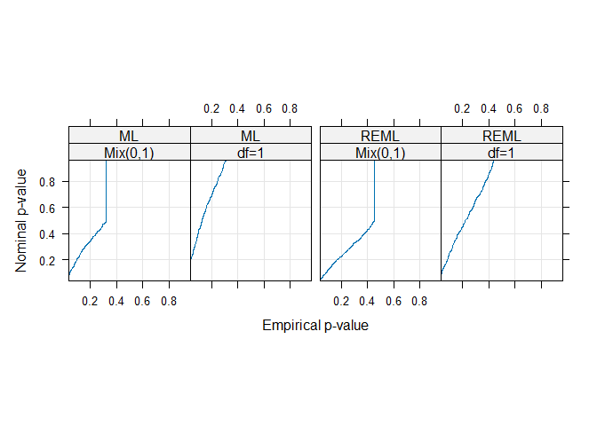<!-- -->

### An Analysis of Covariance Model

$$\begin{aligned}
y_{ij} & = \beta_1 + b_i + \beta_2x_{ij} + \epsilon_{ij},\\
b_i &\sim N(0,\sigma_b^2),\quad \epsilon_{ij}\sim N(0,\sigma^2)
\end{aligned}$$

``` r
> data("Orthodont")
> plot( Orthodont )
```

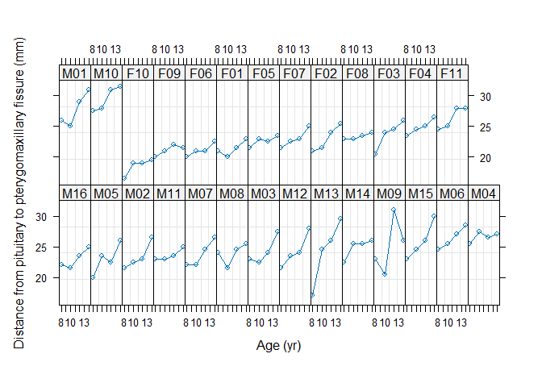<!-- -->

``` r
> names( Orthodont )
```

    [1] "distance" "age"      "Subject"  "Sex"     

``` r
> levels( Orthodont$Sex )
```

    [1] "Male"   "Female"

``` r
> OrthoFem <- Orthodont[ Orthodont$Sex == "Female", ]
```

``` r
> fm1OrthF.lis <- lmList( distance ~ age, data = OrthoFem )
> coef( fm1OrthF.lis )
```

        (Intercept)   age
    F10       13.55 0.450
    F09       18.10 0.275
    F06       17.00 0.375
    F01       17.25 0.375
    F05       19.60 0.275
    F07       16.95 0.550
    F02       14.20 0.800
    F08       21.45 0.175
    F03       14.40 0.850
    F04       19.65 0.475
    F11       18.95 0.675

``` r
> plot( intervals ( fm1OrthF.lis ) )
```

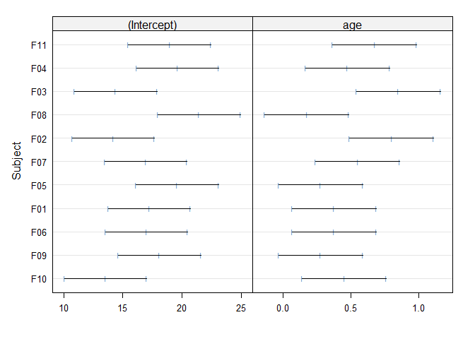<!-- --> center the data

``` r
> fm2OrthF.lis <- update( fm1OrthF.lis, distance ~ I( age - 11 ) )
> plot( intervals( fm2OrthF.lis ) )
```

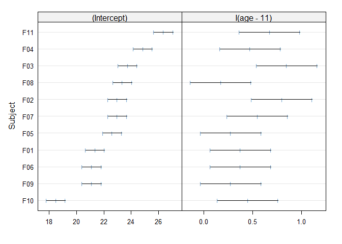<!-- -->

mixed-effects model

``` r
> fm1OrthF <- lme( distance ~ age, data = OrthoFem, random =~1| Subject )
> summary( fm1OrthF )
```

    Linear mixed-effects model fit by REML
      Data: OrthoFem 
           AIC     BIC    logLik
      149.2183 156.169 -70.60916

    Random effects:
     Formula: ~1 | Subject
            (Intercept)  Residual
    StdDev:     2.06847 0.7800331

    Fixed effects:  distance ~ age 
                    Value Std.Error DF   t-value p-value
    (Intercept) 17.372727 0.8587419 32 20.230440       0
    age          0.479545 0.0525898 32  9.118598       0
     Correlation: 
        (Intr)
    age -0.674

    Standardized Within-Group Residuals:
           Min         Q1        Med         Q3        Max 
    -2.2736479 -0.7090164  0.1728237  0.4122128  1.6325181 

    Number of Observations: 44
    Number of Groups: 11 

the REML criterion was created to compensate for the downward bias of
the maximum likelihood estimates of variance components, so it should
produce larger estimates.

``` r
> fm1OrthFM <- update( fm1OrthF, method = "ML" )
> summary( fm1OrthFM )
```

    Linear mixed-effects model fit by maximum likelihood
      Data: OrthoFem 
           AIC      BIC   logLik
      146.0304 153.1672 -69.0152

    Random effects:
     Formula: ~1 | Subject
            (Intercept)  Residual
    StdDev:     1.96987 0.7681235

    Fixed effects:  distance ~ age 
                    Value Std.Error DF   t-value p-value
    (Intercept) 17.372727 0.8506287 32 20.423397       0
    age          0.479545 0.0530056 32  9.047078       0
     Correlation: 
        (Intr)
    age -0.685

    Standardized Within-Group Residuals:
           Min         Q1        Med         Q3        Max 
    -2.3056159 -0.7192392  0.1763611  0.4257994  1.6689361 

    Number of Observations: 44
    Number of Groups: 11 

random effect for intercept and slope

``` r
> fm2OrthF <- update( fm1OrthF, random = ~ age | Subject )
> anova( fm1OrthF, fm2OrthF )
```

             Model df      AIC      BIC    logLik   Test  L.Ratio p-value
    fm1OrthF     1  4 149.2183 156.1690 -70.60916                        
    fm2OrthF     2  6 149.4287 159.8547 -68.71435 1 vs 2 3.789622  0.1503

best linear unbiased predictions (BLUPs)

``` r
> random.effects( fm1OrthF )
```

        (Intercept)
    F10 -4.00532866
    F09 -1.47044943
    F06 -1.47044943
    F01 -1.22903236
    F05 -0.02194701
    F07  0.34017860
    F02  0.34017860
    F08  0.70230420
    F03  1.06442981
    F04  2.15080662
    F11  3.59930904

``` r
> # ranef( fm1OrthF )
> coefficients( fm1OrthF )
```

        (Intercept)       age
    F10    13.36740 0.4795455
    F09    15.90228 0.4795455
    F06    15.90228 0.4795455
    F01    16.14369 0.4795455
    F05    17.35078 0.4795455
    F07    17.71291 0.4795455
    F02    17.71291 0.4795455
    F08    18.07503 0.4795455
    F03    18.43716 0.4795455
    F04    19.52353 0.4795455
    F11    20.97204 0.4795455

``` r
> plot(compareFits(coef(fm1OrthF), coef(fm1OrthFM)))
```

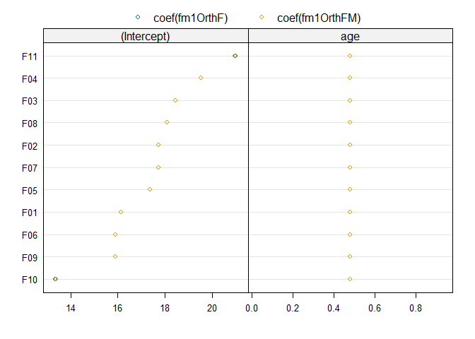<!-- -->

``` r
> plot( augPred(fm1OrthF), aspect = "xy", grid = T )
```

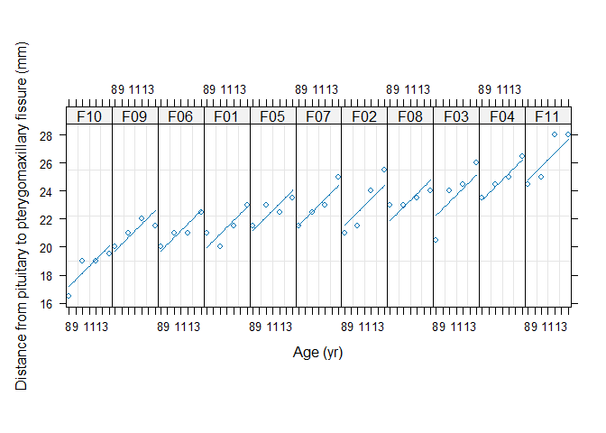<!-- -->

Simulating Likelihood Ratio Test Statistics

generate data according to the null model using the parameter values
from fm1OrthF

``` r
> orthLRTsim <- simulate.lme( fm1OrthF, fm2OrthF, nsim = 1000, seed = 1 )
```

    Warning in unlist(.C(mixed_combined, as.double(conLin$Xy),
    as.integer(unlist(conLin$dims)), : Singular precision matrix in level -1, block
    1

``` r
> plot( orthLRTsim, df = c(1, 2) )
```

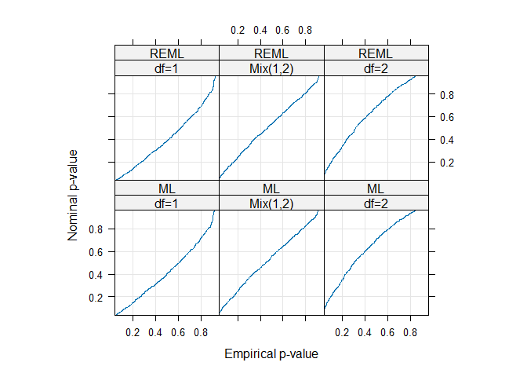<!-- -->

### Models for Nested Classification Factors

$$y_{ijk} = \beta_1 + \beta_2 d_{ik} + \beta_3 d^2_{ik} + b_{i,1} + b_{i,2}d_{ik} + b_{ij} + \epsilon_{ijk}$$

``` r
> data("Pixel")
> plot( Pixel )
```

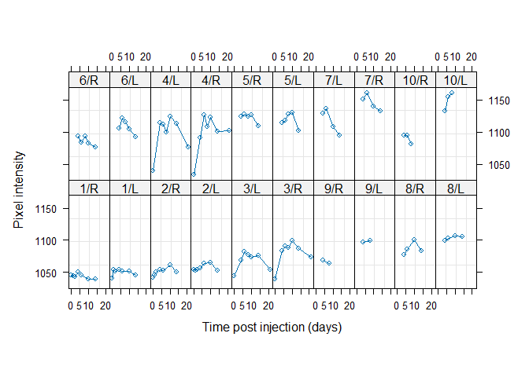<!-- -->

``` r
> fm1Pixel <- lme( pixel ~ day + day^2, data = Pixel,
+                  random = list( Dog = ~ day, Side =~1))
> intervals( fm1Pixel )
```

    Approximate 95% confidence intervals

     Fixed effects:
                      lower         est.        upper
    (Intercept) 1071.415260 1093.2153205 1115.0153808
    day           -1.126044   -0.1486643    0.8287157

     Random Effects:
      Level: Dog 
                              lower       est.      upper
    sd((Intercept))      17.3612663 31.4934093 57.1291753
    sd(day)               0.3591118  1.0719566  3.1998144
    cor((Intercept),day) -0.9822213 -0.7863345  0.2293261
      Level: Side 
                       lower     est.    upper
    sd((Intercept)) 8.519307 15.08987 26.72803

     Within-group standard error:
       lower     est.    upper 
    12.35948 14.53391 17.09090 

``` r
> plot( augPred( fm1Pixel ) )
```

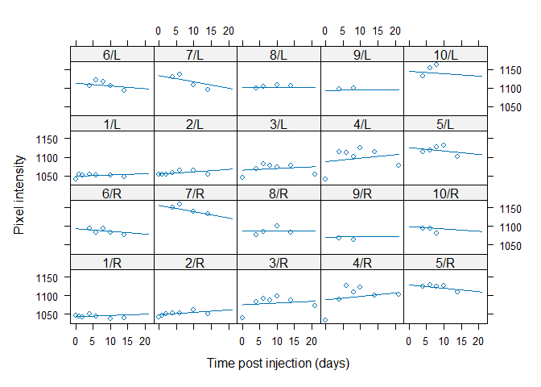<!-- -->

``` r
> VarCorr( fm1Pixel )
```

                Variance       StdDev    Corr  
    Dog =       pdLogChol(day)                 
    (Intercept) 991.834828     31.493409 (Intr)
    day           1.149091      1.071957 -0.786
    Side =      pdLogChol(1)                   
    (Intercept) 227.704292     15.089874       
    Residual    211.234562     14.533911       

``` r
> summary( fm1Pixel )
```

    Linear mixed-effects model fit by REML
      Data: Pixel 
           AIC      BIC    logLik
      900.2666 918.5028 -443.1333

    Random effects:
     Formula: ~day | Dog
     Structure: General positive-definite, Log-Cholesky parametrization
                StdDev    Corr  
    (Intercept) 31.493409 (Intr)
    day          1.071957 -0.786

     Formula: ~1 | Side %in% Dog
            (Intercept) Residual
    StdDev:    15.08987 14.53391

    Fixed effects:  pixel ~ day + day^2 
                    Value Std.Error DF  t-value p-value
    (Intercept) 1093.2153 10.956531 81 99.77750  0.0000
    day           -0.1487  0.491223 81 -0.30264  0.7629
     Correlation: 
        (Intr)
    day -0.668

    Standardized Within-Group Residuals:
            Min          Q1         Med          Q3         Max 
    -3.76834747 -0.41902529  0.02772118  0.37773760  2.19794640 

    Number of Observations: 102
    Number of Groups: 
              Dog Side %in% Dog 
               10            20 

``` r
> fm2Pixel <- lme( pixel ~ day + day^2, data = Pixel,
+                  random =  ~ day | Dog )
> anova( fm1Pixel, fm2Pixel )
```

             Model df      AIC      BIC    logLik   Test  L.Ratio p-value
    fm1Pixel     1  7 900.2666 918.5028 -443.1333                        
    fm2Pixel     2  6 912.1553 927.7863 -450.0776 1 vs 2 13.88866   2e-04

``` r
> fm3Pixel <- update( fm1Pixel, random =~1| Dog/Side )
> anova( fm1Pixel, fm3Pixel )
```

             Model df      AIC      BIC    logLik   Test  L.Ratio p-value
    fm1Pixel     1  7 900.2666 918.5028 -443.1333                        
    fm3Pixel     2  5 899.5381 912.5640 -444.7691 1 vs 2 3.271539  0.1948

``` r
> fm4Pixel <- update( fm1Pixel, pixel ~ day + day^2 + Side )
> summary( fm4Pixel )
```

    Linear mixed-effects model fit by REML
      Data: Pixel 
          AIC      BIC    logLik
      895.071 915.8319 -439.5355

    Random effects:
     Formula: ~day | Dog
     Structure: General positive-definite, Log-Cholesky parametrization
                StdDev   Corr  
    (Intercept) 31.52017 (Intr)
    day          1.07333 -0.786

     Formula: ~1 | Side %in% Dog
            (Intercept) Residual
    StdDev:    15.01697 14.50742

    Fixed effects:  pixel ~ day + Side 
                    Value Std.Error DF  t-value p-value
    (Intercept) 1097.5272 11.562598 81 94.92046  0.0000
    day           -0.1496  0.491215 81 -0.30451  0.7615
    SideR         -8.6098  7.379980  9 -1.16664  0.2733
     Correlation: 
          (Intr) day   
    day   -0.633       
    SideR -0.319  0.000

    Standardized Within-Group Residuals:
            Min          Q1         Med          Q3         Max 
    -3.73906807 -0.38367308  0.04758314  0.39690045  2.23720388 

    Number of Observations: 102
    Number of Groups: 
              Dog Side %in% Dog 
               10            20 

### A Split-Plot Experiment

``` r
> data("Oats")
> plot( Oats )
```

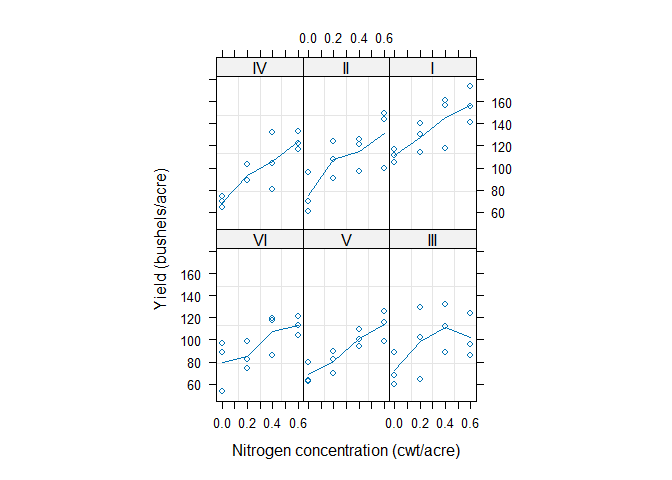<!-- -->

``` r
> fm1Oats <- lme( yield ~ ordered(nitro) * Variety, data = Oats,
+                 random =~1| Block/Variety )
> anova( fm1Oats )
```

                           numDF denDF   F-value p-value
    (Intercept)                1    45 245.14316  <.0001
    ordered(nitro)             3    45  37.68560  <.0001
    Variety                    2    10   1.48534  0.2724
    ordered(nitro):Variety     6    45   0.30282  0.9322

remove interaction

``` r
> fm2Oats <- update( fm1Oats, yield ~ ordered(nitro) + Variety )
> anova( fm2Oats )
```

                   numDF denDF   F-value p-value
    (Intercept)        1    51 245.14518  <.0001
    ordered(nitro)     3    51  41.05277  <.0001
    Variety            2    10   1.48534  0.2724

``` r
> summary( fm2Oats )
```

    Linear mixed-effects model fit by REML
      Data: Oats 
          AIC      BIC    logLik
      587.455 607.1619 -284.7275

    Random effects:
     Formula: ~1 | Block
            (Intercept)
    StdDev:    14.64488

     Formula: ~1 | Variety %in% Block
            (Intercept) Residual
    StdDev:    10.47345 12.74987

    Fixed effects:  yield ~ ordered(nitro) + Variety 
                          Value Std.Error DF   t-value p-value
    (Intercept)       104.50000  7.797492 51 13.401746  0.0000
    ordered(nitro).L   32.94473  3.005172 51 10.962679  0.0000
    ordered(nitro).Q   -5.16667  3.005172 51 -1.719258  0.0916
    ordered(nitro).C   -0.44721  3.005172 51 -0.148815  0.8823
    VarietyMarvellous   5.29167  7.078909 10  0.747526  0.4720
    VarietyVictory     -6.87500  7.078909 10 -0.971195  0.3544
     Correlation: 
                      (Intr) or().L or().Q or().C VrtyMr
    ordered(nitro).L   0.000                            
    ordered(nitro).Q   0.000  0.000                     
    ordered(nitro).C   0.000  0.000  0.000              
    VarietyMarvellous -0.454  0.000  0.000  0.000       
    VarietyVictory    -0.454  0.000  0.000  0.000  0.500

    Standardized Within-Group Residuals:
            Min          Q1         Med          Q3         Max 
    -1.84134149 -0.66279741 -0.06694262  0.63822477  1.66066788 

    Number of Observations: 72
    Number of Groups: 
                 Block Variety %in% Block 
                     6                 18 

remove fixed effect

``` r
> fm3Oats <- update( fm1Oats, yield ~ ordered( nitro ) )
> summary( fm3Oats )
```

    Linear mixed-effects model fit by REML
      Data: Oats 
          AIC      BIC    logLik
      597.605 613.1416 -291.8025

    Random effects:
     Formula: ~1 | Block
            (Intercept)
    StdDev:    14.50609

     Formula: ~1 | Variety %in% Block
            (Intercept) Residual
    StdDev:    11.03871 12.74985

    Fixed effects:  yield ~ ordered(nitro) 
                         Value Std.Error DF   t-value p-value
    (Intercept)      103.97222  6.640669 51 15.656889  0.0000
    ordered(nitro).L  32.94473  3.005169 51 10.962691  0.0000
    ordered(nitro).Q  -5.16667  3.005169 51 -1.719260  0.0916
    ordered(nitro).C  -0.44721  3.005169 51 -0.148815  0.8823
     Correlation: 
                     (Intr) or().L or().Q
    ordered(nitro).L 0                   
    ordered(nitro).Q 0      0            
    ordered(nitro).C 0      0      0     

    Standardized Within-Group Residuals:
            Min          Q1         Med          Q3         Max 
    -1.78155620 -0.61168894  0.02222367  0.62200683  1.68138151 

    Number of Observations: 72
    Number of Groups: 
                 Block Variety %in% Block 
                     6                 18 

remove nonlinear

``` r
> fm4Oats <- lme( yield ~ nitro, data = Oats, random = ~ 1 | Block/Variety )
> summary( fm4Oats )
```

    Linear mixed-effects model fit by REML
      Data: Oats 
           AIC      BIC    logLik
      603.0418 614.2842 -296.5209

    Random effects:
     Formula: ~1 | Block
            (Intercept)
    StdDev:    14.50598

     Formula: ~1 | Variety %in% Block
            (Intercept) Residual
    StdDev:    11.00467 12.86696

    Fixed effects:  yield ~ nitro 
                   Value Std.Error DF  t-value p-value
    (Intercept) 81.87222  6.945280 53 11.78818       0
    nitro       73.66667  6.781483 53 10.86291       0
     Correlation: 
          (Intr)
    nitro -0.293

    Standardized Within-Group Residuals:
            Min          Q1         Med          Q3         Max 
    -1.74380777 -0.66475224  0.01710434  0.54298790  1.80298914 

    Number of Observations: 72
    Number of Groups: 
                 Block Variety %in% Block 
                     6                 18 

``` r
> VarCorr( fm4Oats )
```

                Variance     StdDev  
    Block =     pdLogChol(1)         
    (Intercept) 210.4235     14.50598
    Variety =   pdLogChol(1)         
    (Intercept) 121.1029     11.00467
    Residual    165.5586     12.86696

``` r
> plot( augPred( fm4Oats ), aspect = 2.5, layout = c(6, 3),
+       between = list( x = c(0, 0, 0.5) ) )
```

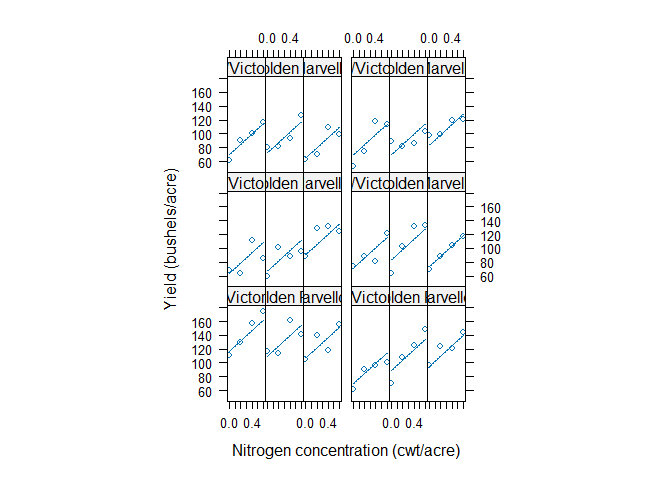<!-- -->
